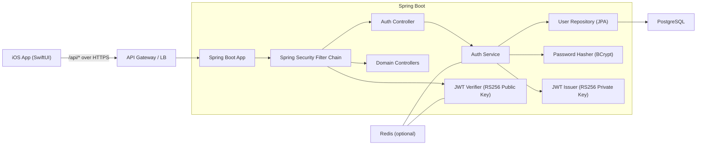
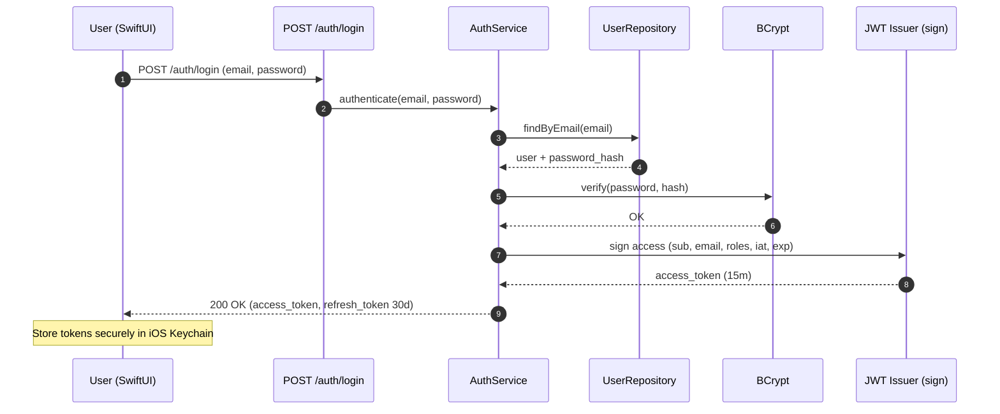
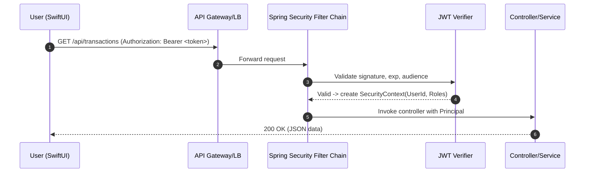
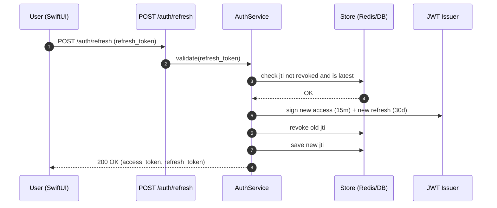
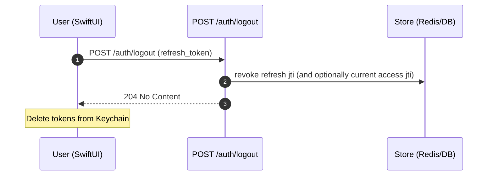

# 🔐 Auth System Architecture (JWT)

This document diagrams how authentication works in the Budget vs. Reality Tracker using **JWTs** with Spring Boot. It covers login, token issuance, authenticated requests, and refresh.

---

## 1) High-Level Components



**Notes**

* **RS256** (asymmetric) recommended so mobile apps never need a secret; server signs with **private key**, verifies with **public key**.
* **Redis (optional)** for refresh-token rotation / revocation lists if needed.
* iOS stores tokens in **Keychain**.

---

## 2) Login & Token Issuance



**Claims & Lifetimes (suggested):**

* `access_token` **15 min** (short‑lived)
* `refresh_token` **30 days**, opaque or JWT with `typ=refresh`, rotate on every refresh
* Include `sub`, `email`, `roles`, `iat`, `exp`, `jti` (for rotation)

---

## 3) Authenticated API Request (with JWT)



**Failure paths:**

* Missing/invalid token → **401** with `WWW-Authenticate: Bearer`
* Token expired → **401** `token_expired` (client should try refresh)
* Insufficient role/scope → **403 Forbidden**

---

## 4) Token Refresh (Rotation, Optional but Recommended)



**Rotation rules:**

* Each refresh **invalidates** the previous refresh token (`jti` blacklist or version counter per user).
* On suspicious activity, **revoke all** user tokens (set user token version ↑).

---

## 5) Sequence: Logout



---

## 6) Spring Boot Implementation Notes

* **Spring Security**

  * Add a `JwtAuthenticationFilter` **before** `UsernamePasswordAuthenticationFilter`.
  * Use `AuthenticationManager` only for `/auth/login` (password auth).
  * Controllers are annotated with `@PreAuthorize("hasRole('USER')")` where needed.
* **Password hashing:** `BCryptPasswordEncoder` (strength 10–12).
* **Key management:**

  * RS256 keypair generated offline; private key injected via secret manager.
  * Roll keys with `kid` header; maintain a small **JWKS** set for verification.
* **Error model:** consistent JSON `{code, message}` for 401/403.

---

## 7) Client (iOS) Storage & Behavior

* Store tokens in **Keychain**; never in UserDefaults.
* Attach `Authorization: Bearer <access_token>` to protected requests.
* On 401 `token_expired`, call `/auth/refresh`; if that fails, route to login.
* Clock skew: refresh proactively when token has <2 minutes remaining.

---

## 8) Minimal Endpoints (MVP)

```
POST   /auth/register       {email, password}
POST   /auth/login          {email, password}
POST   /auth/refresh        {refresh_token}
POST   /auth/logout         {refresh_token}
GET    /me                  -> current user profile
```

---

## 9) Security Defaults (MVP)

* Enforce HTTPS only.
* CORS: allow iOS app origin(s) only; restrict methods/headers.
* Rate limit `/auth/*` (e.g., via gateway or Spring filter).
* Audit logs for auth events (login success/failure, refresh, revoke).
