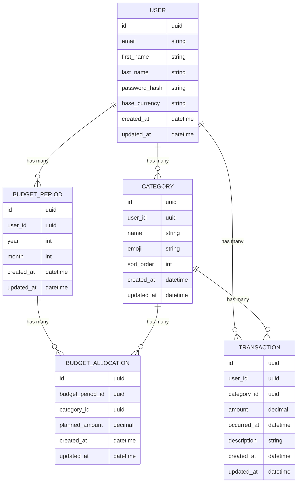

# Database Entities (MVP)

This document outlines the core entities for the **Budget vs. Reality Tracker** MVP.  
These entities form the foundation for user management, budgeting, and transaction tracking.

---

## 🧑‍💼 User
**Description:** Owner of all other records.

**Fields:**
- `id` (UUID)
- `email` (unique)
- `first_name`
- `last_name`
- `password_hash`
- `base_currency` (e.g., `USD`)
- `created_at`
- `updated_at`

---

## 🏷️ Category
**Description:** User-defined buckets for classifying transactions (e.g., Food, Rent).

**Fields:**
- `id` (UUID)
- `user_id` (FK → `User`)
- `name`
- `emoji` (optional)
- `sort_order` (integer)
- `created_at`
- `updated_at`

**Constraints:**
- **Uniqueness:** (`user_id`, `name`)

---

## 📆 BudgetPeriod
**Description:** Represents a single calendar month for a user (e.g., `2025-10`).

**Fields:**
- `id` (UUID)
- `user_id` (FK → `User`)
- `year` (integer)
- `month` (integer, 1–12)
- `created_at`
- `updated_at`

**Constraints:**
- **Uniqueness:** (`user_id`, `year`, `month`)

---

## 💰 BudgetAllocation
**Description:** Planned budget amount for a specific category within a budget period.

**Fields:**
- `id` (UUID)
- `budget_period_id` (FK → `BudgetPeriod`)
- `category_id` (FK → `Category`)
- `planned_amount` (DECIMAL)
- `created_at`
- `updated_at`

**Constraints:**
- **Uniqueness:** (`budget_period_id`, `category_id`)

---

## 📊 Transaction
**Description:** Represents income or expense entries linked to categories.

**Fields:**
- `id` (UUID)
- `user_id` (FK → `User`)
- `category_id` (FK → `Category`)
- `amount` (DECIMAL; positive = income, negative = expense)
- `occurred_at`
- `description` (text, optional)
- `created_at`
- `updated_at`

**Indexes:**
- `(user_id, occurred_at DESC)`
- `(user_id, category_id, occurred_at)`

---

# Database Schema (MVP)

## Entity Relationship Diagram

---

**✅ Summary**

| Entity | Purpose |
|---------|----------|
| **User** | Represents an authenticated account with settings and preferences |
| **Category** | User-defined spending or income categories |
| **BudgetPeriod** | Monthly budgeting window per user |
| **BudgetAllocation** | Planned spending per category and month |
| **Transaction** | Actual income/expense records for comparison |

---

_Last updated: October 2025_
